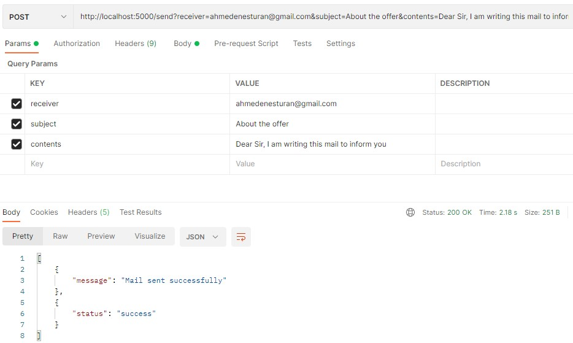

# yagmail -- Yet Another GMAIL/SMTP client

[](https://gitter.im/kootenpv/yagmail?utm_source=badge&utm_medium=badge&utm_campaign=pr-badge&utm_content=badge)
[](https://pypi.python.org/pypi/yagmail/)
[](https://pypi.python.org/pypi/yagmail/)


The goal here is to make it as simple and painless as possible to send emails.

In the end, your code will look something like this:

```python
import yagmail
yag = yagmail.SMTP()
contents = ['This is the body, and here is just text http://somedomain/image.png',
            'You can find an audio file attached.', '/local/path/song.mp3']
yag.send('to@someone.com', 'subject', contents)
```

Or a simple one-liner:

```python
yagmail.SMTP('mygmailusername').send('to@someone.com', 'subject', 'This is the body')
```

Note that it will read the password securely from your keyring (read below). If you don't want this, you can also initialize with:

```python
yag = yagmail.SMTP('mygmailusername', 'mygmailpassword')
```

## Send Email using API



| Parameter  | Type     | Description                   |
| :--------- | :------- | :---------------------------- |
| `receiver` | `string` | Email address of the receiver |
| `subject`  | `string` | Subject of the email          |
| `contents` | `string` | Contents of the email         |

## Automate sending Email using API


## Autherization Gmail Accounts with SMTP

You can use your gmail account credentials to send emails in Python application with yagmail.

If you are using gmail, you can use the following settings to add your gmail account to your keyring: [Enable less secure apps](https://myaccount.google.com/lesssecureapps)

> You need to enable access to less secure apps in your gmail account settings.


---

### Table of Contents

| Section                                             | Explanation                                                   |
| --------------------------------------------------- | ------------------------------------------------------------- |
| [Install](#install)                                 | Find the instructions on how to install yagmail here          |
| [Username and password](#username-and-password)     | No more need to fill in username and password in scripts      |
| [Start a connection](#start-a-connection)           | Get started                                                   |
| [Usability](#usability)                             | Shows some usage patterns for sending                         |
| [Recipients](#recipients)                           | How to send to multiple people, give an alias or send to self |
| [Magical contents](#magical-contents)               | Really easy to send text, html, images and attachments        |
| [Attaching files](#attaching-files)                 | How attach files to the email                                 |
| [DKIM Support](#dkim-support)                       | Add DKIM signature to your emails with your private key       |
| [Feedback](#feedback)                               | How to send me feedback                                       |
| [Roadmap (and priorities)](#roadmap-and-priorities) | Yup                                                           |
| [Errors](#errors)                                   | List of common errors for people dealing with sending emails  |

### Install

For Python 2.x and Python 3.x respectively:

```python
pip install yagmail[all]
pip3 install yagmail[all]

```

If you get problems installing keyring, try installing without, i.e. `pip install yagmail`.

As a side note, `yagmail` can now also be used to send emails from the command line.

### Username and password

[keyring quoted](https://pypi.python.org/pypi/keyring#what-is-python-keyring-lib):

> The Python `keyring` lib provides a easy way to access the system keyring service from python. It can be used in any application that needs safe password storage.

You know you want it. Set it up by opening a Python interpreter and running:

```python
import yagmail
yagmail.register('mygmailusername', 'mygmailpassword')
```

In fact, it is just a wrapper for `keyring.set_password('yagmail', 'mygmailusername', 'mygmailpassword')`.

When no password is given and the user is not found in the keyring, `getpass.getpass()` is used to prompt the user for a password. Upon entering this once, it can be stored in the keyring and never asked again.

Another convenience can be to save a .yagmail file in your home folder, containing just the email username. You can then omit everything, and simply use `yagmail.SMTP()` to connect. Of course, this wouldn't work with more accounts, but it might be a nice default. Upon request I'll consider adding more details to this .yagmail file (host, port and other settings).

### Start a connection

```python
yag = yagmail.SMTP('mygmailusername')
```

Note that this connection is reusable, closable and when it leaves scope it will **clean up after itself in CPython**.

As [tilgovi](https://github.com/tilgovi) points out in [#39](https://github.com/kootenpv/yagmail/issues/39), SMTP does not automatically close in **PyPy**. The context manager `with` should be used in that case.

### Usability

Defining some variables:

```python
to = 'santa@someone.com'
to2 = 'easterbunny@someone.com'
to3 = 'sky@pip-package.com'
subject = 'This is obviously the subject'
body = 'This is obviously the body'
html = '<a href="https://pypi.python.org/pypi/sky/">Click me!</a>'
img = '/local/file/bunny.png'
```

All variables are optional, and know that not even `to` is required (you'll send an email to yourself):

```python
yag.send(to = to, subject = subject, contents = body)
yag.send(to = to, subject = subject, contents = [body, html, img])
yag.send(contents = [body, img])
```

Furthermore, if you do not want to be explicit, you can do the following:

```python
yag.send(to, subject, [body, img])
```

### Recipients

It is also possible to send to a group of people by providing a list of email strings rather than a single string:

```python
yag.send(to = to)
yag.send(to = [to, to2]) # List or tuples for emailadresses *without* aliases
yag.send(to = {to : 'Alias1'}) # Dictionary for emailaddress *with* aliases
yag.send(to = {to : 'Alias1', to2 : 'Alias2'}
```

Giving no `to` argument will send an email to yourself. In that sense, `yagmail.SMTP().send()` can already send an email.
Be aware that if no explicit `to = ...` is used, the first argument will be used to send to. Can be avoided like:

```python
yag.send(subject = 'to self', contents = 'hi!')
```

Note that by default all email addresses are conservatively validated using `soft_email_validation==True` (default).

### Oauth2

It is even safer to use Oauth2 for authentication, as you can revoke the rights of tokens.

[This](http://blog.macuyiko.com/post/2016/how-to-send-html-mails-with-oauth2-and-gmail-in-python.html) is one of the best sources, upon which the oauth2 code is heavily based.

The code:

```python
yag = yagmail.SMTP("user@gmail.com", oauth2_file="~/oauth2_creds.json")
yag.send(subject="Great!")
```

It will prompt for a `google_client_id` and a `google_client_secret`, when the file cannot be found. These variables can be obtained following [the previous link](http://blog.macuyiko.com/post/2016/how-to-send-html-mails-with-oauth2-and-gmail-in-python.html).

After you provide them, a link will be shown in the terminal that you should followed to obtain a `google_refresh_token`. Paste this again, and you're set up!

Note that people who obtain the file can send emails, but nothing else. As soon as you notice, you can simply disable the token.

### Magical `contents`

The `contents` argument will be smartly guessed. It can be passed a string (which will be turned into a list); or a list. For each object in the list:

- If it is a dictionary it will assume the key is the content, and the value is an alias (only for images currently!)
  e.g. {'/path/to/image.png' : 'MyPicture'}
- It will try to see if the content (string) can be read as a file locally,
  e.g. '/path/to/image.png'
- if impossible, it will check if the string is valid html
  e.g. `<h1>This is a big title</h1>`
- if not, it must be text.
  e.g. 'Hi Dorika!'

Note that local files can be html (inline); everything else will be attached.

Local files require to have an extension for their content type to be inferred.

As of version 0.4.94, `raw` and `inline` have been added.

- `raw` ensures a string will not receive any "magic" (inlining, html, attaching)
- `inline` will make an image appear in the text.

### Attaching Files

There are multiple ways to attach files in the `attachments` parameter (in addition to magical `contents` parameter).

1. One can pass a list of paths i.e.

```python
yag.send(to=recipients,
         subject=email_subject,
         contents=contents,
         attachments=['path/to/attachment1.png', 'path/to/attachment2.pdf', 'path/to/attachment3.zip']
)
```

2. One can pass an instance of [`io.IOBase`](https://docs.python.org/3/library/io.html#io.IOBase).

```python
with open('path/to/attachment', 'rb') as f:
    yag.send(to=recipients,
             subject=email_subject,
             contents=contents,
             attachments=f
             )
```

In this example `f` is an instance of `_io.BufferedReader` a subclass of the abstract class `io.IOBase`.

`f` has in this example the attribute `.name`, which is used by yagmail as filename as well as to detect the correct MIME-type.
Not all `io.IOBase` instances have the `.name` attribute in which case yagmail names the attachments `attachment1`, `attachment2`, ... without a file extension!
Therefore, it is highly recommended setting the filename with extension manually e.g. `f.name = 'my_document.pdf'`

A real-world example would be if the attachment is retrieved from a different source than the disk (e.g. downloaded from the internet or [uploaded by a user in a web-application](https://docs.streamlit.io/en/stable/api.html#streamlit.file_uploader))

### DKIM Support

To send emails with dkim signature, you need to install the package with all related packages.

```
pip install yagmail[all]
# or
pip install yagmail[dkim]
```

Usage:

```python
from yagmail import SMTP
from yagmail.dkim import DKIM
from pathlib import Path

# load private key from file/secrets manager
private_key = Path("privkey.pem").read_bytes()

dkim_obj = DKIM(
  domain=b"a.com",
  selector=b"selector",
  private_key=private_key,
  include_headers=[b"To", b"From", b"Subject"],
  # To include all default headers just pass None instead
  # include_headers=None,
)

yag = SMTP(dkim=dkim_obj)

# all the rest is the same
```

### Feedback

I'll try to respond to issues within 24 hours at Github.....

And please send me a line of feedback with `SMTP().feedback('Great job!')` :-)

### Roadmap (and priorities)

- ~~Added possibility of Image~~
- ~~Optional SMTP arguments should go with \*\*kwargs to my SMTP~~
- ~~CC/BCC (high)~~
- ~~Custom names (high)~~
- ~~Allow send to return a preview rather than to actually send~~
- ~~Just use attachments in "contents", being smart guessed (high, complex)~~
- ~~Attachments (contents) in a list so they actually define the order (medium)~~
- ~~Use lxml to see if it can parse the html (low)~~
- ~~Added tests (high)~~
- ~~Allow caching of content (low)~~
- ~~Extra other types (low)~~ (for example, mp3 also works, let me know if something does not work)
- ~~Probably a naming issue with content type/default type~~
- ~~Choose inline or not somehow (high)~~
- ~~Make lxml module optional magic (high)~~
- ~~Provide automatic fallback for complex content(medium)~~ (should work)
- ~~`yagmail` as a command on CLI upon install~~
- ~~Added `feedback` function on SMTP to be able to send me feedback directly :-)~~
- ~~Added the option to validate emailaddresses...~~
- ~~however, I'm unhappy with the error handling/logging of wrong emails~~
- ~~Logging count & mail capability (very low)~~
- ~~Add documentation to exception classes (low)~~
- ~~add `raw` and `inline`~~
- ~~oauth2~~
- ~~Travis CI integration ~~
- ~~ Add documentation to all functions (high, halfway) ~~
- Prepare for official 1.0
- Go over documentation again (medium)
- Allow `.yagmail` file to contain more parameters (medium)
- Add option to shrink images (low)

### Errors

- Make sure you have a keyring entry (see section <a href="#no-more-password-and-username">No more password and username</a>), or use getpass to register. I discourage to use username / password in scripts.

- [`smtplib.SMTPException: SMTP AUTH extension not supported by server`](http://stackoverflow.com/questions/10147455/trying-to-send-email-gmail-as-mail-provider-using-python)

- [`SMTPAuthenticationError: Application-specific password required`](https://support.google.com/accounts/answer/185833)

- **YagAddressError**: This means that the address was given in an invalid format. Note that `From` can either be a string, or a dictionary where the key is an `email`, and the value is an `alias` {'sample@gmail.com': 'Sam'}. In the case of 'to', it can either be a string (`email`), a list of emails (email addresses without aliases) or a dictionary where keys are the email addresses and the values indicate the aliases.

- **YagInvalidEmailAddress**: Note that this will only filter out syntax mistakes in emailaddresses. If a human would think it is probably a valid email, it will most likely pass. However, it could still very well be that the actual emailaddress has simply not be claimed by anyone (so then this function fails to devalidate).

- Click to enable the email for being used externally https://www.google.com/settings/security/lesssecureapps

- Make sure you have a working internet connection

- If you get an `ImportError` try to install with `sudo`, see issue #13
